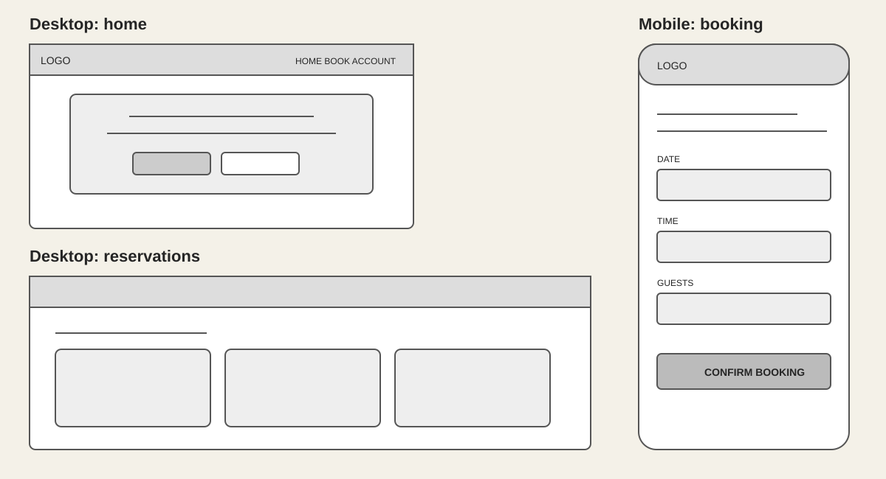
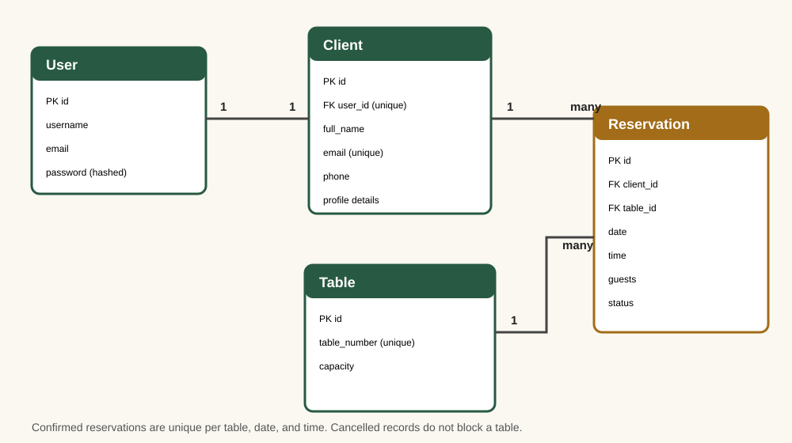

# The Green Fork — Restaurant Booking System

[Live application](https://restaurant-booking-system-kell.onrender.com) | [GitHub repository](https://github.com/OviO17/restaurant-booking-system) | [Issues](https://github.com/OviO17/restaurant-booking-system/issues)

The Green Fork is a full-stack Django application for reserving restaurant tables. Registered users can create, view, edit, cancel, and permanently delete their own reservations. The application assigns the smallest suitable available table, prevents confirmed double bookings, and keeps each user's data private.

## Assessor Testing Credentials

To test the full reservation functionality, please use the following account:

Username: assessor_admin
Password: Assessor123!

This account has access to all booking, editing, cancellation, and deletion features required for assessment.

## Project goals

- Make booking understandable without knowing database date or time formats.
- Provide complete CRUD data management, including confirmed permanent deletion.
- Prevent table conflicts while allowing cancelled slots to be reused.
- Keep reservation operations authenticated and restricted to their owner.
- Give administrators and terminal-created users the same usable customer journey.
- Provide reproducible planning, testing, local setup, and deployment evidence.

## User experience

The interface uses native date, time, and number controls with visible guidance. Dates before today cannot be selected, service hours are shown as 12:00–22:00, and party size is restricted to 1–12. Forms retain server-side validation because browser constraints alone are not a security boundary. Responsive cards, obvious status badges, keyboard focus states, empty-state guidance, feedback messages, and a deliberate delete confirmation make core journeys clearer.

### User journey

1. Create an account or log in.
2. Choose a future date, arrival time, and party size.
3. Receive the smallest available table that fits the party.
4. View or edit the reservation.
5. Cancel it to retain history while releasing the table, or permanently delete it after confirmation.

### Wireframes

The initial low-fidelity layouts establish hierarchy and responsive behaviour for the home, booking, and reservation screens. The implementation evolved the neutral wireframe into the green, cream, and gold visual system while retaining the planned structure.



### Screenshots

| Home | Booking | Reservations |
|---|---|---|
|  |  |  |

## Agile development

User stories are mapped to epics, priorities, goals, and testable acceptance criteria in [the Agile planning record](docs/AGILE.md). Each story is designed to become an individual repository issue, while the GitHub Projects board tracks `Backlog`, `Ready`, `In progress`, `Review`, and `Done`. The resubmission work is identified as a remediation sprint rather than being presented as retrospective evidence of the initial development process.

Key epics are Accounts, Reservations, UX, Quality, and Documentation. “Must have” stories cover the complete CRUD journey, profile reliability, automated tests, and reproducible deployment; responsive refinements are “Should have.”

The repository owner can complete the live evidence using the concise [GitHub Projects board setup checklist](docs/GITHUB_BOARD_SETUP.md).

## Features

### Accounts and permissions

- Registration, login, and logout using Django authentication.
- A one-to-one `Client` profile is automatically created for every `User`, including superusers created at the terminal.
- Existing users missing profiles are repaired by a data migration or on first authenticated use.
- Booking pages require authentication.
- Edit, cancel, and delete lookups include the signed-in owner and return 404 for another user's record.
- CSRF tokens protect every state-changing form; Django stores passwords as secure hashes.

### Reservation management

- Create reservations with native date/time pickers and a constrained party-size control.
- View personal reservation details and status.
- Edit active reservations without the record conflicting with itself.
- Cancel while retaining history and releasing the table.
- Permanently delete from the database through an explicit confirmation screen.
- Assign the smallest table that meets party capacity.
- Prevent more than one confirmed booking for the same table, date, and time at database level.

### Validation and feedback

- Reject past dates and past times on the current date.
- Accept service times only from 12:00 through 22:00.
- Accept party sizes only from 1 through 12.
- Prevent editing cancelled reservations.
- Display inline validation, no-availability feedback, and success messages.

## Data design



- Django `User` has exactly one `Client` profile.
- A `Client` owns many `Reservation` records.
- A `Table` can appear in many reservations across different slots.
- Each `Reservation` belongs to one client and one table.
- A conditional uniqueness constraint prevents duplicate **confirmed** table slots while permitting cancelled history and rebooking.

Deleting a user cascades to their profile and reservations. Deleting a client cascades to reservations. Tables use `PROTECT`, preventing removal of a table that is referenced by reservation history.

## Technologies

- Python and Django
- HTML5 and CSS3
- SQLite for zero-configuration local development
- PostgreSQL in production through `DATABASE_URL`
- Gunicorn and WhiteNoise on Render
- Git, GitHub Issues, and GitHub Projects

## Testing

The automated suite covers profiles, superuser navigation, input controls and validation, all CRUD operations, table release, delete confirmation, and cross-user authorisation. Detailed commands, cases, and the manual acceptance matrix are in [TESTING.md](docs/TESTING.md).

Current local verification:

```text
System check identified no issues.
No changes detected by makemigrations --check.
16 tests passed.
```

Previous HTML and CSS validator evidence is stored in `assets/images/html-validation.png` and `assets/images/css-validation.png`. Validation should be repeated after each front-end change and the screenshots refreshed before final submission.

## Local installation

### Prerequisites

- Python 3.12 or newer
- Git

### Setup

```bash
git clone https://github.com/OviO17/restaurant-booking-system.git
cd restaurant-booking-system
python -m venv venv
```

Activate the environment:

```bash
# Windows PowerShell
.\venv\Scripts\Activate.ps1

# macOS/Linux
source venv/bin/activate
```

Install and run:

```bash
pip install -r requirements.txt
python manage.py migrate
python manage.py createsuperuser
python manage.py runserver
```

Open `http://127.0.0.1:8000/`. Without `DATABASE_URL`, settings use the local `db.sqlite3` database.

Create restaurant tables either in `/admin/` or in the Django shell before accepting bookings:

```python
from bookings.models import Table
Table.objects.get_or_create(table_number=1, defaults={"capacity": 2})
Table.objects.get_or_create(table_number=2, defaults={"capacity": 4})
Table.objects.get_or_create(table_number=3, defaults={"capacity": 6})
Table.objects.get_or_create(table_number=4, defaults={"capacity": 12})
```

## Deployment to Render

1. Push the repository to GitHub.
2. In Render, create a PostgreSQL database and copy its internal database URL.
3. Create a Python Web Service connected to this repository.
4. Select a supported Python 3.12+ runtime.
5. Use build command `pip install -r requirements.txt && python manage.py collectstatic --noinput`.
6. Use start command `gunicorn config.wsgi:application`.
7. Add the environment variables below.
8. Run `python manage.py migrate` as a pre-deploy command (or once in the Render shell before the first start).
9. Deploy, create a superuser with `python manage.py createsuperuser`, and add restaurant tables through `/admin/`.
10. Test the public account and assessor-admin journeys on the live service.

### Environment variables

| Variable | Required | Value/purpose |
|---|---|---|
| `SECRET_KEY` | Yes | Long unpredictable production secret |
| `DATABASE_URL` | Production | Render PostgreSQL internal URL |
| `DEBUG` | Yes | `False` in production; never expose debug pages publicly |

`.env`, virtual environments, bytecode, and secrets are excluded by `.gitignore`. `ALLOWED_HOSTS` permits localhost and Render hosts, and WhiteNoise serves compressed manifest static assets.

## Known limitations and future work

- Opening hours are currently fixed rather than configurable per weekday.
- Table assignment is automatic; customers cannot choose a table or seating area.
- The application does not yet send confirmation emails.
- A restaurant-manager dashboard could expose availability and service configuration without using Django admin.

## Credits

Built as a Code Institute full-stack Django portfolio project. Django documentation informed the authentication, model, form, testing, and deployment patterns.
