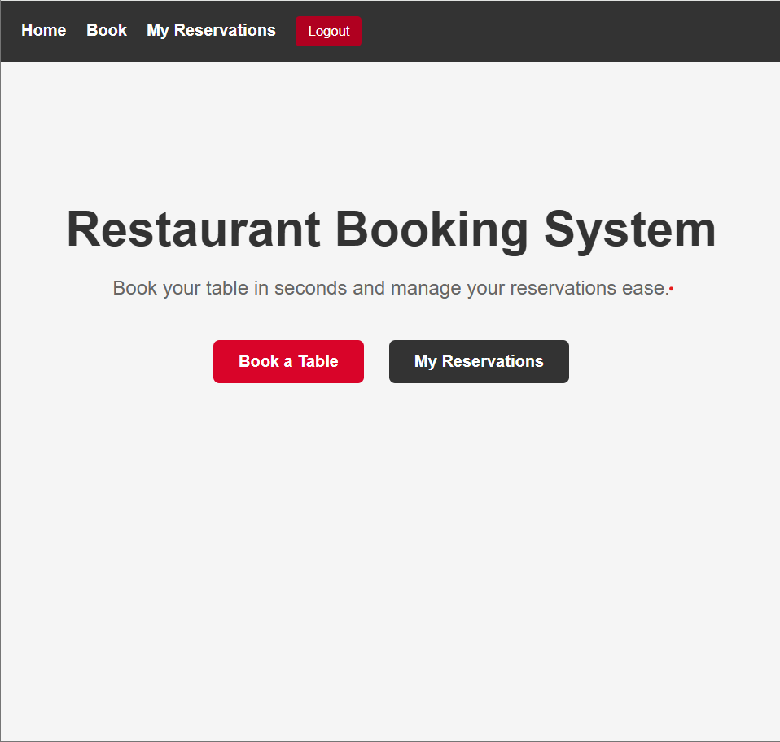
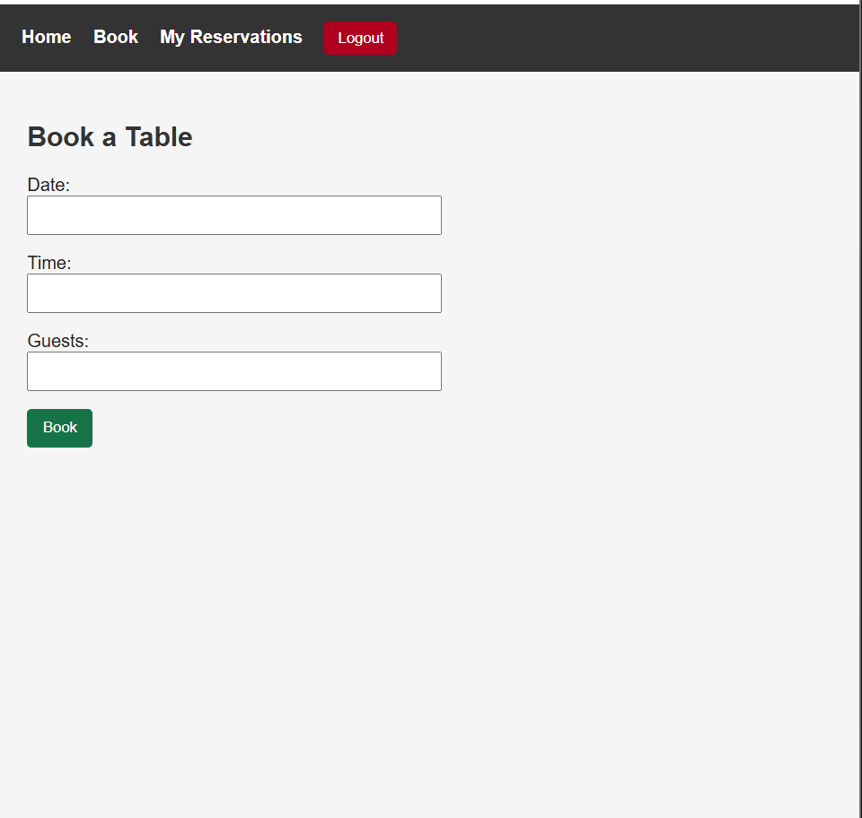
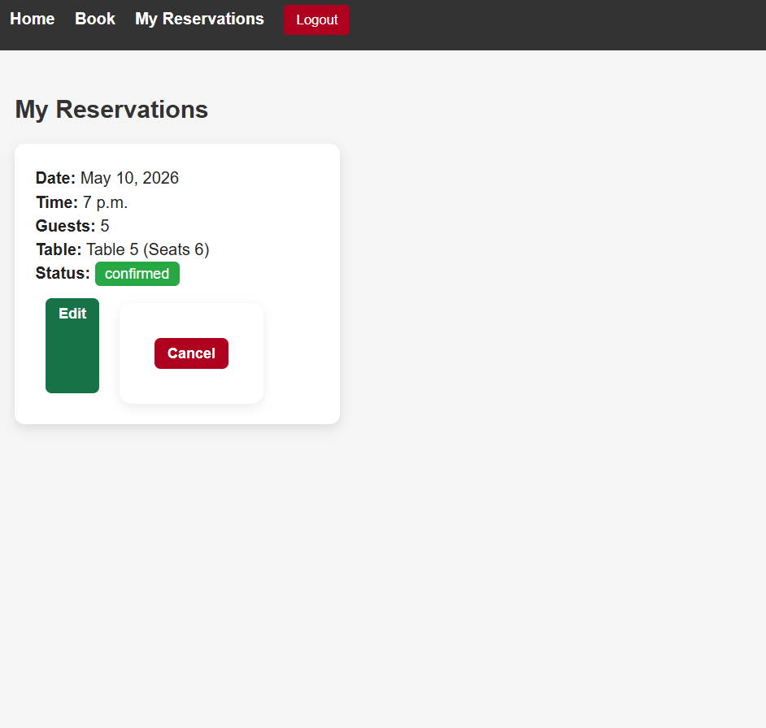
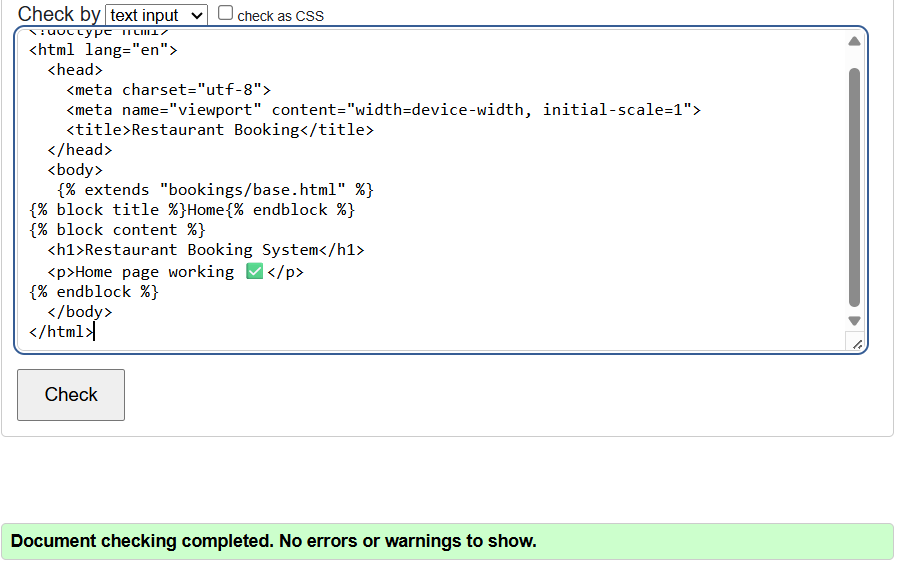
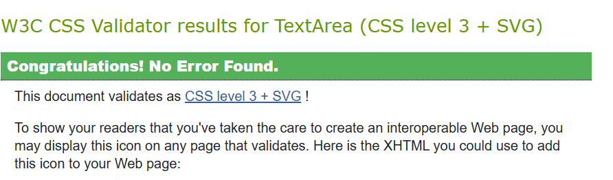

# Restaurant Booking System

## Overview

The Restaurant Booking System is a full-stack web application built using Django that allows users to create accounts, book tables, manage reservations, and view booking history.

The application simulates a real-world restaurant reservation system with user authentication, table allocation logic, and strong data validation.

---

## Live Project

🔗 Live Link: *(add your deployed link here)*

---

## User Experience (UX)

### Design Goals

- Simple and intuitive booking process
- Clear navigation between pages
- Immediate feedback through messages
- Clean and readable layout

### User Flow

1. User signs up or logs in  
2. User books a table  
3. User views reservations  
4. User edits or cancels booking  

---

## Features

### Authentication

- User registration
- Login and logout functionality
- Only authenticated users can access booking features

### Booking System

- Book tables by date, time, and number of guests
- Automatic table assignment based on availability
- Prevents double bookings

### Reservation Management

- View personal reservations
- Edit bookings
- Cancel bookings
- Cancelled bookings free up table availability

### Validation and Logic

- Prevents past date bookings
- Prevents past time bookings on the same day
- Limits guest numbers from 1 to 12
- Prevents editing cancelled reservations
- Only confirmed bookings block table availability

### User Interface

- Navigation bar
- Card-style reservation display
- Status indicators
- Feedback messages
- Responsive layout

---

## Screenshots

### Home Page


### Booking Page


### Reservations Page


---

## Database Structure

### Models

#### User
Django built-in authentication model

#### Client
- Linked to User
- Stores personal details

#### Table
- Table number
- Capacity

#### Reservation
- Client
- Table
- Date
- Time
- Guests
- Status

---

## Testing

### Manual Testing

| Feature | Test Action | Expected Result | Result |
|---|---|---|---|
| Signup | Valid data | Account created | Pass |
| Login | Correct credentials | Login successful | Pass |
| Booking | Valid input | Reservation created | Pass |
| Booking | Past date | Error shown | Pass |
| Booking | Past time | Error shown | Pass |
| Booking | Too many guests | Error shown | Pass |
| Edit Booking | Change details | Updated successfully | Pass |
| Cancel Booking | Click cancel | Status updated | Pass |
| Rebooking | Cancel then rebook | Table available again | Pass |
| Security | Access another user data | Blocked | Pass |

---

### Validation Testing

- Past date booking blocked
- Past time booking blocked
- Guest limits enforced
- Cancelled bookings cannot be edited
- Only confirmed bookings block tables

---

## Bugs and Fixes

| Bug | Fix |
|---|---|
| Duplicate admin registration | Removed duplicate registration |
| URL errors | Fixed URL patterns |
| Static files not loading | Corrected static configuration |
| Cancelled bookings editable | Added validation logic |
| Tables not freeing | Filtered by confirmed status |

---

## Validation

### HTML Validation

W3C Validator used.

Note: Django template syntax such as `` may show warnings and is expected.



### CSS Validation



---

## Deployment

### Local Deployment

```bash
git clone https://github.com/OviO17/restaurant-booking-system
cd restaurant-booking
python -m venv venv
.\venv\Scripts\Activate.ps1
pip install -r requirements.txt
python manage.py migrate
python manage.py runserver

